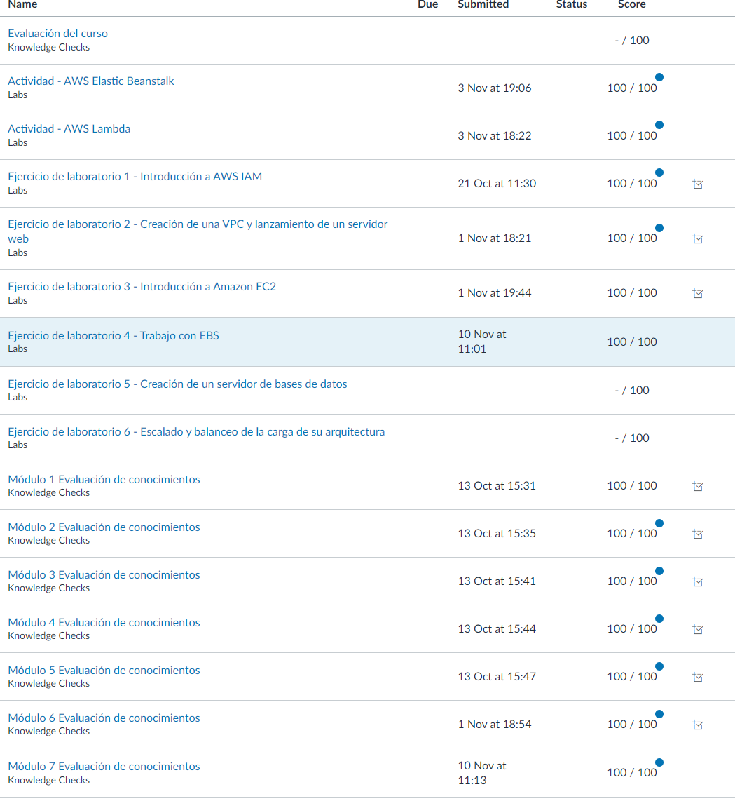

# Práctica 2: Parte A

---

## AWS Academy Cloud Foundations

### Amazon Elastic Block Store (EBS)

- **Ejercicio de laboratorio 4:** Trabajo con EBS (Amazon Elastic Block Store)
  - **Requisito:** Obtener una puntuación igual o superior al 70%.

    

-------

[Pincha aquí para volver a la página principal](/README.md)