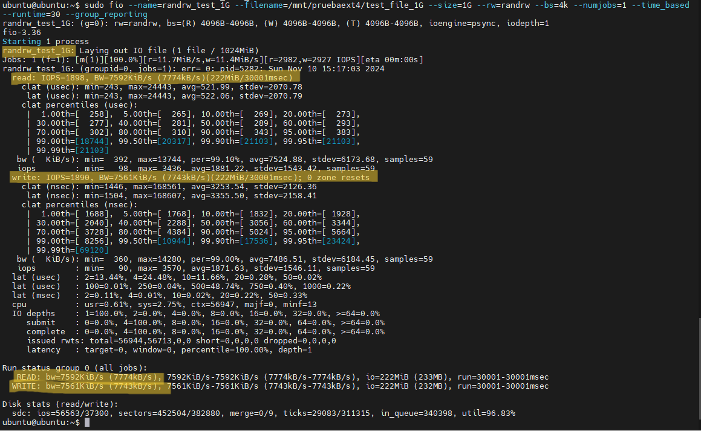

# Parte B: Configuración de sistemas de ficheros y "Benchmarking" - Linux

## Parte 1: Configuración de Particiones y Sistemas de Archivos

### Paso 1: Adjuntar los Dispositivos de Bloque a la Máquina Virtual

1. En la consola de OCI, agregamos dos dispositivos de bloque de 50 GB cada uno a la máquina virtual con Ubuntu.

   

2. En en apartado de `Block Storages`, accedemos a `Block Volumes`, y pulsamos en `Create Block Volume`. Nombramos cada volumen como `blockvol1`y `blockvol2` y creamos os volumenes.

   

   

3. Aquí podemos ver como nuestro `blockvol2`se esta generando, una vez esten en verde, los tendremos preparados para agregarlos a nuestra máquina virtual.

   

4. En la ventana de cada volumen creado, pulsamos sobre `Attached block volumes` y seguidamente en `Attach to Instance`.

   

5. El Attachment type lo cambiamos por `Paravirtualized`, seleccionamos en `Instance` nuestra instancia creada y le colocamos el `Device path` como `vdb` y `vdc` respectivamente.

   

6. Aquí podemos ver los volumenes `Attached` (Añadidos), ahora iniciamos nuestra máquina y nos conectamos por SSH.
   
   

7. Verificamos que los dispositivos estén disponibles en el sistema ejecutando:

   ```bash
   lsblk
   ```
   Como vemos hay dos nuevos dispositivos (`/dev/sdb` y `/dev/sdc`).

### Paso 2: Crear Particiones en los Dispositivos de Bloque

1. Utilizaremos `fdisk` para crear una partición en cada dispositivo.

   - Para el primer dispositivo (`/dev/sdb`):

     ```bash
     sudo fdisk /dev/sdb
     ```

        

     - Ingresamos `n` para crear una nueva partición.
     - Seleccionamos las opciones predeterminadas para particionar todo el espacio.
     - Presionamos `w` para finalizar el proceso.

   - Repetiremos el proceso para el segundo dispositivo (`/dev/sdc`).

2. Verificamos las particiones:

   

   ```bash
   lsblk
   ```

   Ahora aparecen `/dev/sdb1` y `/dev/sdc1` como las nuevas particiones.

### Paso 3: Crear Sistemas de Archivos en las Particiones

1. En el dispositivo `/dev/sdb1`, crea un sistema de archivos XFS:

   ```bash
   sudo mkfs.xfs /dev/sdb1
   ```

   

2. En el dispositivo `/dev/sdc1`, crea un sistema de archivos EXT4:

   ```bash
   sudo mkfs.ext4 /dev/sdc1
   ```

   

### Paso 4: Montar las Particiones

1. Crea los directorios de montaje:

   ```bash
   sudo mkdir -p /mnt/pruebaxfs
   sudo mkdir -p /mnt/pruebaext4
   ```

   

2. Monta las particiones en los directorios:

   ```bash
   sudo mount /dev/sdb1 /mnt/pruebaxfs
   sudo mount /dev/sdc1 /mnt/pruebaext4
   ```

   

   ```bash
   lsblk
   ```

   

3. Comprobamos que estan montadas las particiones en los puntos de montaje que hemos creado.

## Parte 2: Benchmark de IOPS y Throughput

### Paso 1: Instalar Herramientas de Benchmark

Para medir el rendimiento, vamos usar la herramienta `fio`.

1. Instalamos `fio` (si no está instalado):

   ```bash
   sudo apt update
   sudo apt install fio
   ```

### Paso 2: Ejecutar Benchmark de IOPS y Throughput

Oracle nos promete en los block volumes que hemos creado un rendimiento de:

>

Estos son los comandos que vamos a usar para hacer los test de IOPS y Throughput. Vamos a realizar el test de lectura, escritura y lectura/escritura para ver el resultado.

1. Lectura   

 ```bash
sudo fio --name=read_test_1G --filename=/mnt/DISCO/test_file_1G --size=TAMAÑO --rw=read --bs=4k --numjobs=1 --time_based --runtime=30 --group_reporting
   ```

2. Escritura

 ```bash
sudo fio --name=write_test_1G --filename=/mnt/DISCO/test_file_1G --size=TAMAÑO --rw=write --bs=4k --numjobs=1 --time_based --runtime=30 --group_reporting
   ```

3. Lectura/Escritura

 ```bash
sudo fio --name=randrw_test_1G --filename=/mnt/DISCO/test_file_1G --size=TAMAÑO --rw=randrw --bs=4k --numjobs=1 --time_based --runtime=30 --group_reporting
   ```

Nosotros vamos a realizar un test de `100kb` y de `1GB`, para ello debemos colocar en los comandos `100k` o `1G` en lugar de `TAMAÑO` y colocar la particion correcta donde pone `DISCO`.

A continuacion se mostrarán los resultados de los test, se han hecho 3 medidas de cada, pero unicamente voy a poner 2 captura de cada ya que son muchas captuaras y los resultados son muy parecidas:

## 1. Tests 1

   ### 1. Lectura 

   - 100k

   

   - 1G

   
 
   ### 2. Escritura 

   - 100k

   

   - 1G

   

   ### 3. Lectura/Escritura 

   - 100k

   

   - 1G

   

## 2. Tests 2

   ### 1. Lectura 

   - 100k

   

   - 1G

   
 
   ### 2. Escritura 

   - 100k

   

   - 1G

   

   ### 3. Lectura/Escritura 

   - 100k

   

   - 1G

   


## 3. ORACLE Metrics

   * ### IOPS

   

   * ### Throughput

   

   Aquí se muestra las graficas que aparecen en los `blocks volumes` en la página de Oracle Cloud. Parece como si tuviese un limite puesto en el IOPS y en Throughput. Durante los test llegan al limite de los 3000 IOPS y los 24MB/s.

### Paso 3: Interpretar los Resultados

Los resultados del comando `fio` incluyen métricas clave como:

- **IOPS (Input/Output Operations Per Second)**: mide la cantidad de operaciones de E/S por segundo.
- **Throughput**: mide la velocidad de transferencia de datos en MB/s.

## Análisis de las Pruebas de Rendimiento

### Análisis General

Las pruebas realizadas abarcan distintos tipos de operaciones de entrada/salida (E/S), incluyendo lectura y escritura secuencial, así como operaciones aleatorias de lectura y escritura. El rendimiento medido en términos de IOPS (operaciones de entrada/salida por segundo), ancho de banda y utilización revela cómo se comporta el sistema de almacenamiento bajo diferentes cargas. A continuación, se desglosan las observaciones para cada tipo de operación.

---

### 1. Lectura Secuencial

| Prueba   | Tamaño | IOPS | BW           | Utilización |
|----------|--------|------|--------------|-------------|
| Lectura 1 | 100K  | 5954 | 23.3 MiB/s   | 95.17%      |
| Lectura 2 | 100K  | 5863 | 22.9 MiB/s   | 94.02%      |
| Lectura 3 | 100K  | 5860 | 23.0 MiB/s   | 94.10%      |
| Lectura 1 | 1G    | 5998 | 23.4 MiB/s   | 98.79%      |
| Lectura 2 | 1G    | 6006 | 23.5 MiB/s   | 98.88%      |
| Lectura 2 | 1G    | 6000 | 23.5 MiB/s   | 98.85%      |

**Observaciones:**
- **IOPS Consistentes**: Las pruebas de lectura secuencial muestran valores de IOPS relativamente estables (alrededor de 5900-6000 IOPS) independientemente del tamaño del archivo (100K o 1G). Esto sugiere que el sistema de almacenamiento mantiene un rendimiento constante en operaciones de lectura secuencial.
- **Ancho de Banda (BW)**: El ancho de banda se mantiene cercano a los 23-24 MiB/s, que está dentro de los límites teóricos esperados para el volumen "Balanced". Esto indica que el almacenamiento proporciona un rendimiento de transferencia constante y optimizado para lecturas secuenciales.
- **Alta Utilización**: La utilización varía entre 94% y 98%, lo que sugiere que el sistema de almacenamiento está aprovechando eficientemente los recursos disponibles durante estas pruebas de lectura.

**Conclusión:**
El sistema de almacenamiento está bien optimizado para lecturas secuenciales, ofreciendo un rendimiento estable y cercano a los límites teóricos. Esto es ideal para aplicaciones que requieren un flujo constante de datos, como la transmisión de medios o la carga de grandes volúmenes de datos de manera secuencial.

---

### 2. Escritura Secuencial

| Prueba    | Tamaño | IOPS | BW           | Utilización |
|-----------|--------|------|--------------|-------------|
| Escritura 1 | 100K | 920K | 3595 MiB/s   | 99.23%      |
| Escritura 2 | 100K | 1115K | 4495 MiB/s   | 99.32%      |
| Escritura 3 | 100K | 980K | 4044 MiB/s   | 99.16%      |
| Escritura 1 | 1G   | 6213 | 24.3 MiB/s   | 98.80%      |
| Escritura 2 | 1G   | 6577 | 25.7 MiB/s   | 99.04%      |
| Escritura 3 | 1G   | 6432 | 25.0 MiB/s   | 98.96%      |

**Observaciones:**
- **Valores Altos de IOPS en Escritura de Archivos Pequeños**: En las pruebas con archivos de 100K, los IOPS alcanzan valores extremadamente altos (1115K y 920K). Esto es probable debido a optimizaciones temporales y caché en el sistema de almacenamiento, y no es representativo de un rendimiento sostenido en cargas de trabajo prolongadas.
- **IOPS Consistentes en Archivos Grandes**: Para archivos de 1G, los IOPS se mantienen alrededor de los 6000-6500, lo cual es el doble de los 3000 IOPS teóricos proporcionados por OCI para un volumen "Balanced". Esto sugiere que el sistema puede ofrecer un rendimiento mejorado en pruebas breves de escritura secuencial, posiblemente debido a optimizaciones internas.
- **Ancho de Banda (BW)**: El ancho de banda para archivos grandes (1G) se mantiene en el rango de 24-25 MiB/s, cumpliendo con el rendimiento teórico de OCI. Para archivos pequeños, el ancho de banda es mucho más alto debido a la alta tasa de IOPS observada.
- **Alta Utilización**: La utilización del sistema es muy alta (cerca del 99%) en todas las pruebas de escritura, lo que indica un uso intensivo de los recursos de almacenamiento.

**Conclusión:**
El rendimiento de escritura secuencial muestra que el sistema es capaz de manejar una alta tasa de operaciones por segundo, especialmente con archivos pequeños, probablemente debido a la caché. Para archivos grandes, el rendimiento es estable y dentro de los límites teóricos. Este rendimiento es adecuado para aplicaciones que requieren una escritura rápida y secuencial de datos.

---

### 3. Lectura/Escritura

| Prueba             | Tamaño | IOPS       | BW           | Utilización |
|--------------------|--------|------------|--------------|-------------|
| Lectura/Escritura 1           | 100K   | 503K/503K  | 1964 MiB/s   | 99.19%      |
| Lectura/Escritura 2           | 100K   | 570K/570K  | 2227 MiB/s   | 98.46%      |
| Lectura/Escritura 3           | 100K   | 552K/552K  | 2102 MiB/s   | 98.04%      |
| Lectura/Escritura 1           | 1G     | 1915/1908  | 7626 KiB/s   | 95.70%      |
| Lectura/Escritura 2           | 1G     | 1898/1890  | 7592 KiB/s   | 96.83%      |
| Lectura/Escritura 3           | 1G     | 1890/1888  | 7585 KiB/s   | 96.75%      |

**Observaciones:**
- **Elevados IOPS en Archivos Pequeños**: Las pruebas con archivos de 100K muestran IOPS muy altos (alrededor de 500K-570K para lectura y escritura aleatoria). Esto es un comportamiento típico en pruebas de archivos pequeños, donde las operaciones aleatorias pueden completarse más rápidamente debido a la optimización de la caché.
- **Rendimiento Disminuido en Archivos Grandes**: Para archivos de 1G, los IOPS bajan a alrededor de 1900, lo cual es un rendimiento más realista en situaciones de acceso aleatorio con archivos grandes, donde las operaciones son más costosas y menos optimizadas por la caché.
- **Ancho de Banda (BW)**: El ancho de banda para archivos grandes (1G) es más bajo (alrededor de 7.5 MiB/s), reflejando el costo de acceso aleatorio en bloques grandes. Para archivos pequeños, el ancho de banda es mucho mayor debido al alto número de IOPS.
- **Alta Utilización**: La utilización del sistema sigue siendo alta en todas las pruebas, especialmente con archivos pequeños, donde alcanza casi el 99%.

**Conclusión:**
El rendimiento de lectura/escritura aleatoria es alto para archivos pequeños debido a las optimizaciones y el uso de la caché. Sin embargo, para archivos grandes, el rendimiento se reduce, lo que es esperado en operaciones aleatorias. Este tipo de rendimiento es adecuado para aplicaciones que requieren acceso rápido a pequeñas porciones de datos, como bases de datos de alta concurrencia.

---

### Resumen Final

- **Lectura y Escritura Secuencial**: El rendimiento es constante y cumple con los límites teóricos de OCI, con un uso eficiente de los recursos y un ancho de banda estable.
- **Lectura/Escritura Aleatoria**: El sistema optimiza el acceso aleatorio en archivos pequeños con alta IOPS, pero muestra un rendimiento más conservador en archivos grandes.
- **Optimización de la Caché**: Los altos valores de IOPS en algunas pruebas son probablemente impulsados por la caché y optimizaciones temporales del sistema, lo que permite picos en el rendimiento que pueden no sostenerse en uso prolongado.

#### En conclusión, los resultados indican que el volumen "Balanced" de OCI es capaz de sostener sus especificaciones teóricas en términos de ancho de banda y supera los IOPS teóricos en algunas circunstancias de prueba.


-------

[Pincha aquí para volver a la página anterior](/ParteB/README.md)