# Parte B: Configuración de sistemas de ficheros - Windows

# Configuración de Discos: NTFS y FAT32 en Windows

## Parte 1: Configuración de Discos

### Adjuntar los Dispositivos de Bloque a la Máquina Virtual

Realizamos el mismo método usado en para Linux. Creamos nuestra máquina virtual de Windows y le agregamos los dos `Blocks Storages` que hemos creado anteriormente. Puede consultar la [guía](/ParteB/Linux/README.md) de Linux de como se realiza.

Una vez tenemos nuestro Windows iniciado con los discos agregados, procedemos a crear las particiones en un disco con NTFS y en otro disco con FAT32.

## Parte 2: Crear y Nombrar 4 Particiones en el Disco NTFS y Particionado FAT32 del otro Disco

1. **Abrimos el Administrador de Discos** en Windows:

   - Presionando `Win + X` y seleccionamos **Administración de discos**.

   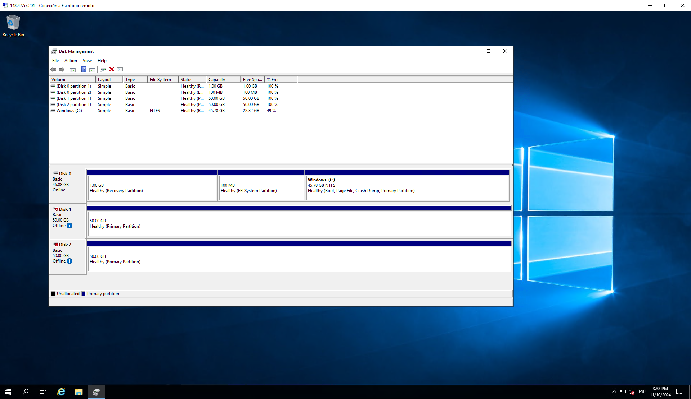

Hacemos clic derecho en cada disco y marcamos la opción `online` para activarlos y seguidamente eliminamos las particiones que trae por defecto.

2. **Crear Particiones en el Primer Disco (NTFS)**:

   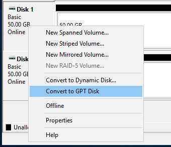

- Antes de hacer nada cambiamos las tablas de particiones de los discos a GPT.

   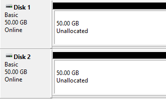

 - Seleccionamos el primer disco, hacemos clic derecho en el espacio no asignado y elegimos **Nuevo Volumen Simple**.

   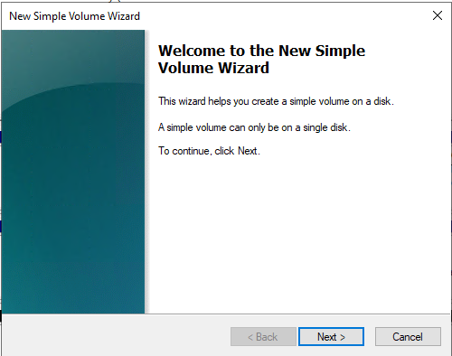

   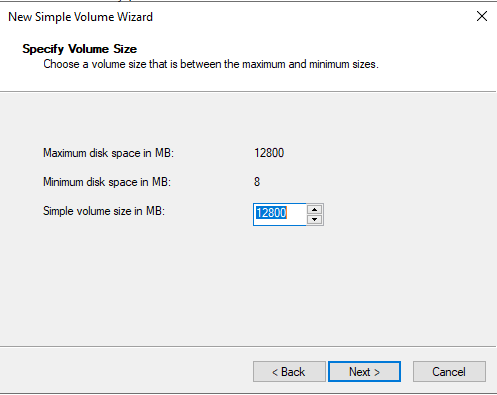

   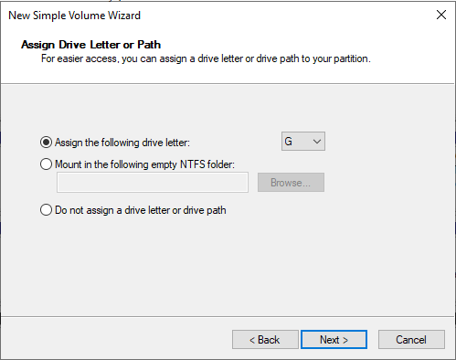

   - Creamos las particiones de 12800MB para que todas sean del mismo tamaño. (Puedes hacerlo del tamaño que prefieras).

   - En el asistente, asignamos el sistema de archivos **NTFS** y nombramos los discos como refleja el ejercicio.

3. **Nombrar las Particiones**:
   - Nombramos las particiones de la siguiente manera:
     - **backup**
     - **basedatos**
     - **codigo**
     - **imagenes**
   - Asignamos una letra de unidad distinta para cada partición, de manera que se muestren en el explorador de archivos.

   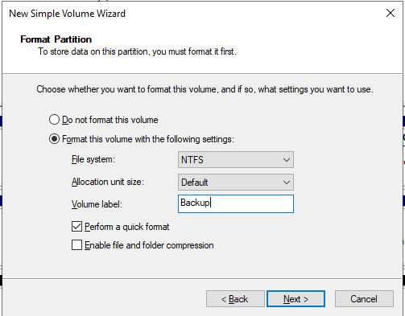

   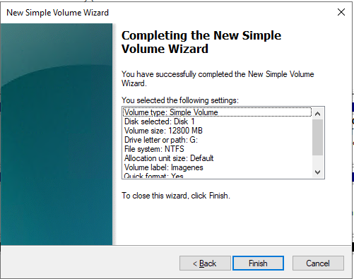

- Finalizamos.

   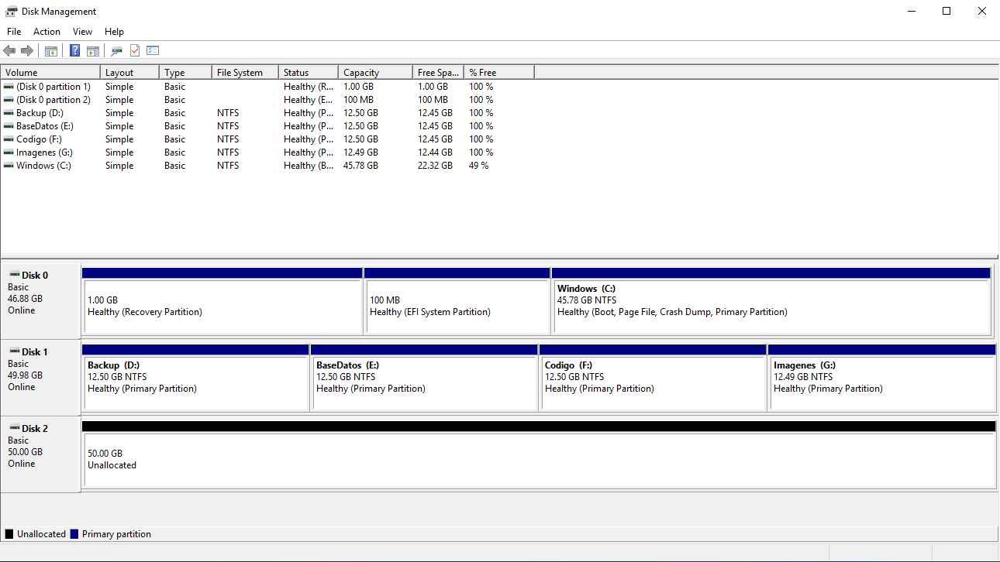

- Nuestro disco NTFS de 50GB esta listo con las 4 particiones.

4. **Crear Particiones en el Segundo Disco (FAT32)**:
   - Repetimos el proceso anterior, pero esta vez vamos a seleccionar **FAT32** como sistema de archivos.

   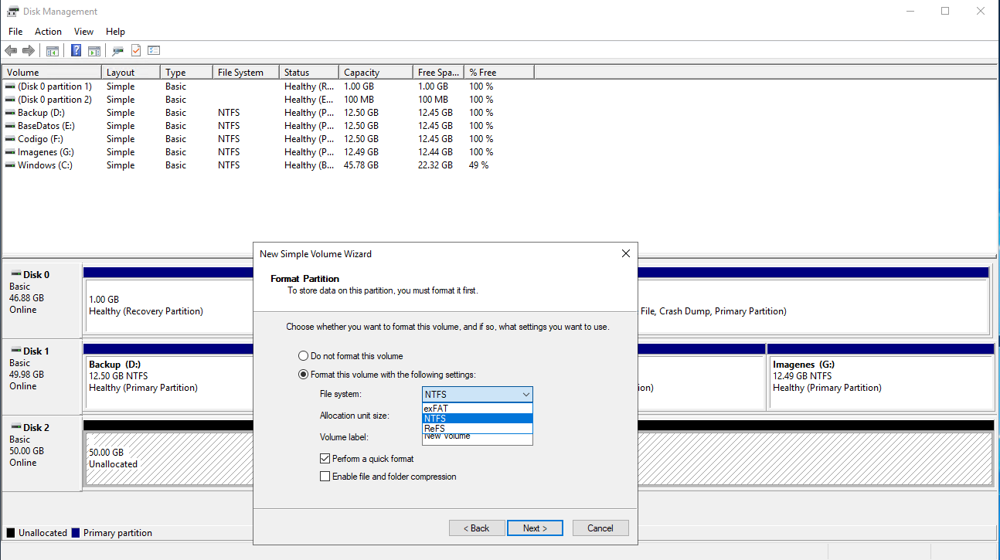

- Vemos como no nos deja crear una partición de FAT32, ya que FAT32 esta limitada hasta particiones de 32GB. 

  - **Nota**: [Microsoft ha anunciado que desde la Build 27686 de Windows 11, permitirá formatear discos duros en FAT32 hasta 2TB de capacidad](https://blogs.windows.com/windows-insider/2024/08/15/announcing-windows-11-insider-preview-build-27686-canary-channel/)

   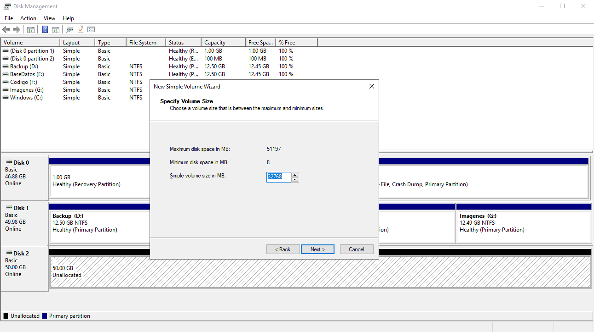

- Volvemos atrás y cambiamos el tamaño a 32768MB (32GB) y continuamos.

   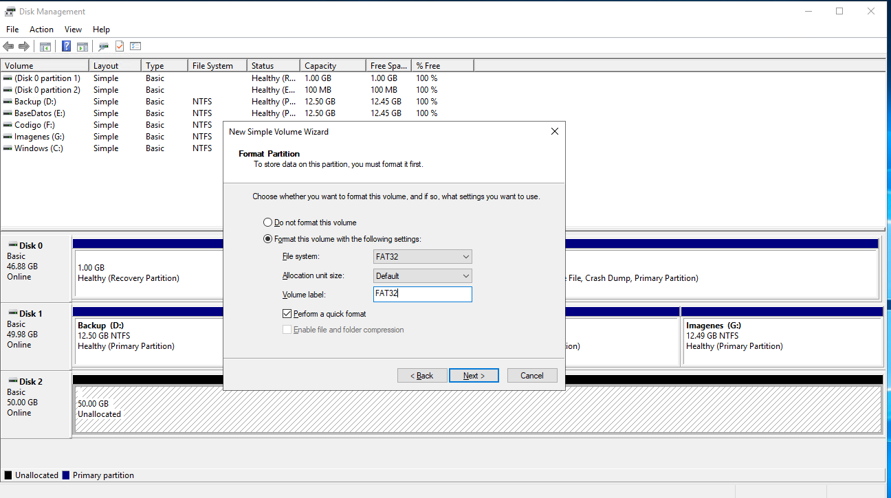

- Ahora si nos deja formatear la partición de 32GB a FAT32.

   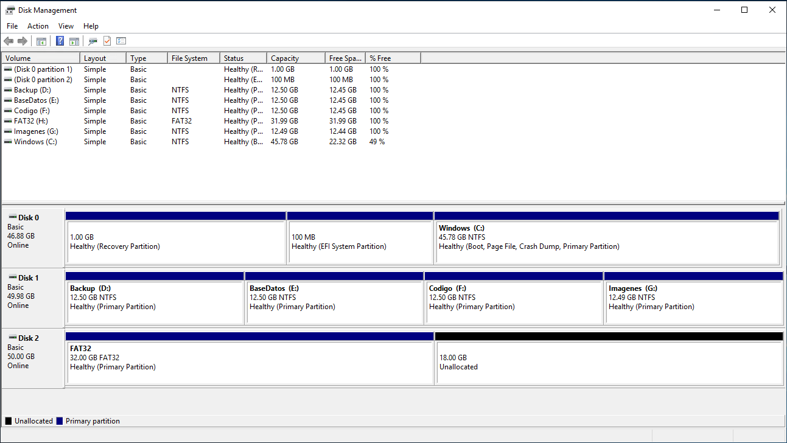

- Como vemos aquí, ya tenemos esa partición FAT32 creada, pero no es realmente lo que queremos. Nosotros queremos el disco entero.

   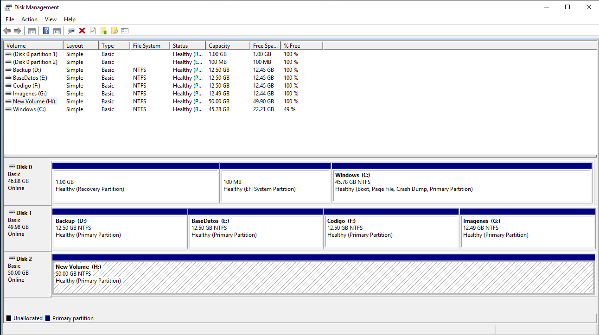

- Para tener el disco entero formateado en FAT32, vamos a borrar la partición que habíamos creado y seguidamente creamos una entera en formato NTFS.

   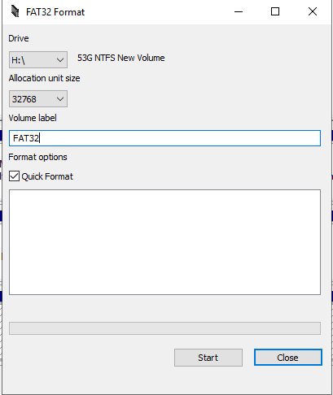

- Vamos a utilizar esta herramienta para formatear los discos en FAT32 "FAT32 Format". Seleccionamos la letra `H:\` que en este caso es donde esta nuestro disco con la partición NTFS, y pulsamos sobre `Start`.

   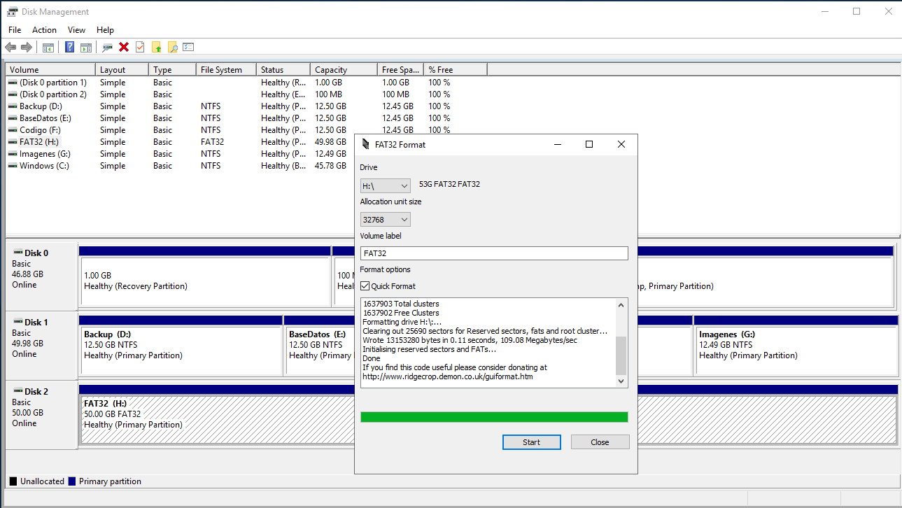

- Cuando termine el formateo del disco, ya lo tendremos completamente en FAT32.

### Problemas y Soluciones Potenciales

1. **Limitación de Tamaño en FAT32**:
   - **Problema**: Windows limita el tamaño máximo de particiones FAT32 a 32 GB.
   - **Solución**: Utilizar herramientas de terceros para crear particiones FAT32 de mayor tamaño o dividir el disco en particiones de hasta 32 GB.

2. **Compatibilidad de Archivos en FAT32**:
   - **Problema**: FAT32 no admite archivos de más de 4 GB.
   - **Solución**: Si necesitas almacenar archivos grandes, como bases de datos o imágenes de disco, utiliza NTFS en su lugar.

3. **Limitaciones de Número de Particiones (MBR vs. GPT)**:
   - **Problema**: Si el disco está inicializado como MBR (Master Boot Record), solo podrás crear hasta cuatro particiones primarias. Si necesitas más, será necesario convertir el disco a **GPT** (GUID Partition Table).
   - **Solución**: Para convertir a GPT, haz clic derecho en el disco en el Administrador de Discos y selecciona **Convertir a GPT** antes de crear las particiones (esto eliminará los datos del disco, por lo que es importante hacer una copia de seguridad).

-------

[Pincha aquí para volver a la página anterior](/ParteB/README.md)
